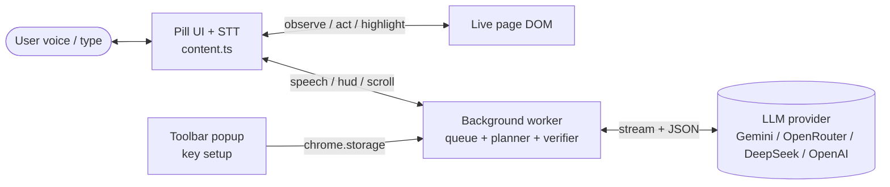
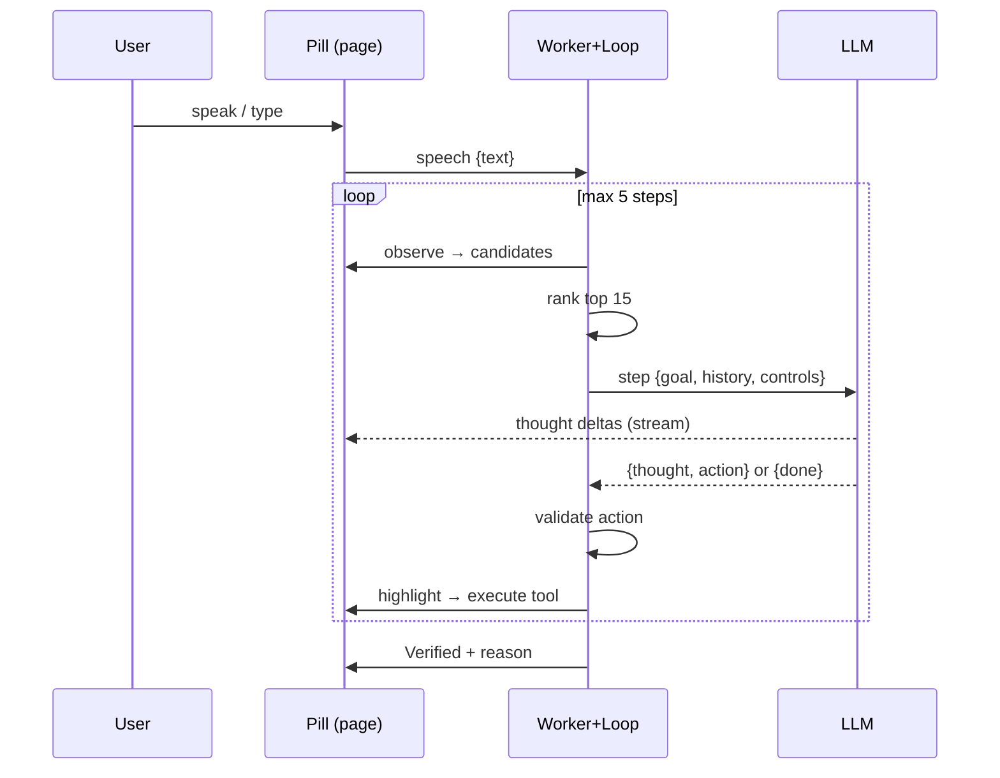
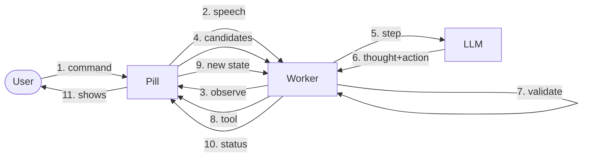

# Software Requirement Specification — HandsFree

**Version:** 0.2 (midterm) · **Track:** Major Project · **Author:** project team

| Rev | Date       | Change                                              |
| --- | ---------- | --------------------------------------------------- |
| 0.1 | midterm wk | Initial SRS: prototype loop, planner/verifier split |
| 0.2 | midterm wk | ReAct loop, step contract, traceability matrix      |

## 1. Introduction

### 1.1 Purpose

HandsFree lets a user operate any website by voice (with typing as fallback):
speak or type a command in the on-page assistant, and an AI agent observes the
live page, plans one action, shows its thinking, highlights the target, acts,
verifies the outcome, and can be interrupted mid-task.

### 1.2 Scope

In scope: MV3 Chrome extension working on the user's own tabs (any site),
voice + typed commands, single and bounded multi-step tasks (max 5 steps),
interrupt, key setup popup. Out of scope: mobile browsers, file downloads,
payments/banking automation, multi-tab orchestration, offline mode.

### 1.3 Definitions

STT (speech-to-text), ARIA (accessible roles/names), LLM (large language
model), SW (service worker), pill (on-page assistant card).

## 2. Overall Description

### 2.1 Product perspective

Single extension: content script (eyes/hands/pill + voice, runs in every page),
background worker (serial queue, interrupts, routing), ReAct loop
(`loop.ts`: one validated model decision per step, max 5), mechanical tools
(`tools.ts`), step contract (`prompts.ts`), provider clients (`llm.ts`),
key-setup popup. No server, no second browser window. A frozen Node prototype
(`src/`) exists only as a deterministic demo harness.

### 2.2 User classes

End users (browse hands-free); evaluators (verify M1–M5 acceptance).

### 2.3 Constraints & assumptions

Desktop Chrome 109+; internet for LLM; user grants mic per site; pages expose
standard ARIA semantics; cross-origin iframes are not visible to the agent.

## 3. Functional Requirements

| ID   | Requirement                                                                                                                                                                                      |
| ---- | ------------------------------------------------------------------------------------------------------------------------------------------------------------------------------------------------ |
| FR1  | Voice input via built-in Web Speech API in the page; interim text live, final result dispatched as a command; typed fallback in the pill                                                         |
| FR2  | Observe: scan the live DOM into role + accessible-name candidates (cap 200), excluding the pill itself, hidden and disabled nodes                                                                |
| FR3  | Rank candidates against intent (keyword + fill-intent box boost, top 15 to the model); `scroll` tool available when nothing relevant is in view                                                  |
| FR4  | Decide: each step the LLM emits one validated `{thought, action}` (`click / fill / navigate / pressEnter / scroll`) or `{done}`; top-15 pre-ranked shortlist; single-rule fallback without a key |
| FR5  | Act: highlight target (400 ms), then execute the validated tool (human-like fill: expand, focus, real keystroke events)                                                                          |
| FR6  | Multi-step: fresh observation after every act doubles as the verdict; loop continues until the model declares the goal done (max 5); per-step retries (max 2 invalid), then help text            |
| FR7  | Verify: folded into the loop — each observation judges the previous act; single-rule keyword fallback without a key                                                                              |
| FR8  | Interrupt: "stop/cancel/wait" aborts the running controller, clears the queue, accepts a replacement intent ("stop, actually …")                                                                 |
| FR9  | HUD: single-line status + streaming thought line, mic morphs to stop while working, minimize, light/dark adaptive                                                                                |
| FR10 | Key setup: provider + model + key with live Test against the provider; first-run nudge when no key is saved                                                                                      |

## 4. Non-Functional Requirements

- Performance: one model call per step (streamed); single-step command typically 2–5 s; local paths (ranking, heuristic submit) add ~0 ms.
- Reliability: every failure surfaces on the pill with a retry hint; no silent hangs; abort < 500 ms.
- Usability: one input bar, one result line; empty states and mic errors in plain words.
- Privacy: key in `chrome.storage.local`, sent only to the chosen provider; page text sent per command; no analytics.
- Portability: any desktop Chrome; any public website with standard semantics.

## 5. Architecture & Methodology

Single-process MV3 design: page (senses/acts) ↔ worker (queues/routes) ↔
loop (ReAct decisions) ↔ provider (reasons). Layers share two JSON contracts —
`Candidate {id,selector,description,method,role}` and step
`{thought, action:{tool,index?,value?,target?} | done, reason?}` — so any layer
can be swapped (e.g. local model for cloud) without touching the others.

Agent pattern: **ReAct with a validating executor**. Each step the model emits
one validated `{thought, action}` or `{done}`; dumb tools execute; every
outcome returns as the next observation (max 5 steps). Invalid actions are
unexecutable by construction (schema, bounds, timeouts) — never merely
discouraged by prompt wording.

Methodology: **iterative prototyping**. A 48-hour ruthless prototype proved the
loop on one page first (voice → observe → plan → highlight → act → verify →
interrupt); each iteration since replaced one simulated part with a real one
(ARIA eyes, real verifier, ReAct loop). Chosen over waterfall because the core
risk was interaction feasibility, not specification completeness.

## 6. IPC Design

| Channel       | Mechanism              | Payload                                                 |
| ------------- | ---------------------- | ------------------------------------------------------- |
| Pill → worker | `runtime.sendMessage`  | `{type:'speech', text, isFinal}`, `{type:'hello'}`      |
| Worker → page | `tabs.sendMessage`     | `observe / act / pressEnter / scroll / highlight / hud` |
| Page → worker | `runtime.sendMessage`  | `{candidates}`, `{ok}`                                  |
| Keepalive     | `runtime.connect` Port | worker stays alive mid-task                             |
| Key storage   | `chrome.storage.local` | provider, model, apiKey                                 |

## 7. Modularity, Coupling, Cohesion

High cohesion, one job per file: `content.ts` senses/acts/shows, `background.ts`
queues/interrupts/routes, `loop.ts` decides, `tools.ts` executes, `prompts.ts`
contracts, `llm.ts` talks providers, `popup.ts` configures. Low coupling:
layers share only the `Candidate`/step contracts — the decider never sees the
DOM, the page never sees the model. Content scripts are dependency-free classic
scripts (one module token kills injection); the worker alone uses modules.

## 8. External Libraries & APIs

Playwright + Express + Zod + p-queue (frozen Node demo harness only); Google
AI (`streamGenerateContent` SSE) and OpenAI-compatible `chat/completions`
streaming (product path, direct `fetch`, no SDK); MV3 `chrome.tabs/runtime/
storage/scripting` APIs. No ML runs locally — reasoning is API-based.

## 9. Use Cases & Acceptance

- UC1 voice search: "search for cats" on Google → results page, verified.
- UC2 voice comment: "comment nice video" on a video → comment posted, verified.
- UC3 interrupt: "stop" mid-task → halts < 500 ms, accepts next command.

Acceptance (maps to demo moments M1–M5): M1 transcript < 300 ms; M2 valid
plan 10/10 rehearsed; M3 highlight visible before every act; M4 interrupt
aborts and re-plans; M5 failure detected and retried (max 2), then help text.

## 10. Traceability (FR → code → acceptance)

| FR   | Implements                                          | Proves        |
| ---- | --------------------------------------------------- | ------------- |
| FR1  | `content.ts` toggleMic, type box                    | M1            |
| FR2  | `content.ts` observe (ARIA)                         | M2            |
| FR3  | `loop.ts` rankForGoal, `scroll` tool                | M2            |
| FR4  | `prompts.ts` ACTOR_SYSTEM + validateStep, `loop.ts` | M2            |
| FR5  | `tools.ts` actOn, `content.ts` act/highlight        | M3            |
| FR6  | `loop.ts` runGoal (max 5)                           | M5            |
| FR7  | observation-as-verdict, fallbackStep                | M5            |
| FR8  | `background.ts` interrupt + queue                   | M4            |
| FR9  | `content.ts` pill, `hud.ts`                         | M1–M5 display |
| FR10 | `popup.ts`, `content.ts` hello nudge                | setup         |
