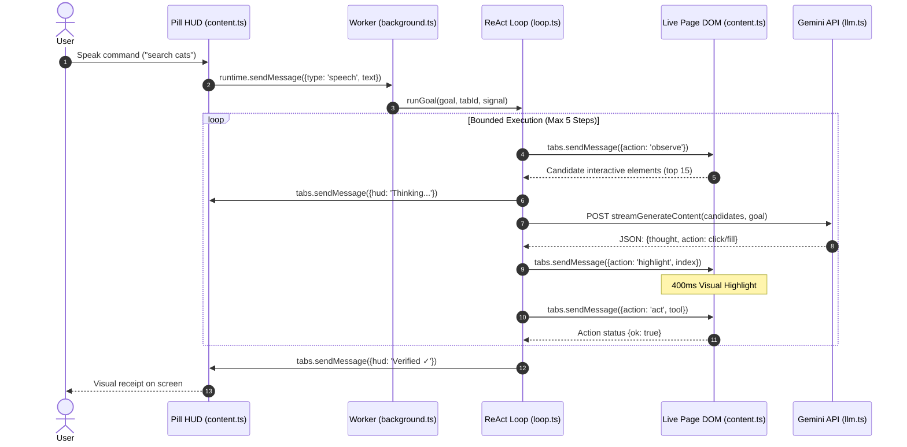

# Software Requirement Specification (SRS) — HandsFree

**Project Title:** HandsFree — Voice-Controlled Browser Automation  
**Document Type:** Technical Document / Software Requirement Specification  
**Milestone:** Mid-Term Evaluation  
**Project Track:** Major Project (with Minor Project foundational concepts addressed)  
**Team Members:**

1. **Kushagra** (Team Lead — Core ReAct Loop, Agent Planner, LLM Integration)
2. **Vedant** (DOM Observation, ARIA Extraction Engine, Action Tools)
3. **Adarsh** (Pill UI HUD, Speech-to-Text Pipeline, IPC Message Routing)

---

## 1. Executive Summary & Working Status (60%+ Completion)

HandsFree is a voice-driven Chrome extension (Manifest V3) that allows users to navigate and interact with web pages using voice commands or text input. The system observes interactive page elements, plans actions using an AI reasoning loop (ReAct), highlights target elements on the live DOM, executes actions, and continuously verifies results.

### 60% Code Completion Status Table

The mid-term milestone requires at least 60% code completion with working core functionality:

| Component                      | Responsible Member | Implementation Files       | Status      | Completion % | Working Proof                                                                                        |
| :----------------------------- | :----------------- | :------------------------- | :---------- | :----------- | :--------------------------------------------------------------------------------------------------- |
| **Pill UI & User HUD**         | Adarsh             | `content.ts`, `hud.ts`     | Working     | 100%         | Floating overlay renders on tabs, live status line, pulsing mic indicator, minimize support.         |
| **Speech & Audio Input**       | Adarsh             | `content.ts`, `llm.ts`     | Working     | 80%          | `getUserMedia` recording with auto-stop on silence; audio transcribed via Gemini audio API.          |
| **IPC Message Routing**        | Adarsh / Kushagra  | `background.ts`            | Working     | 90%          | Serial queue, `chrome.tabs.sendMessage`, `runtime.sendMessage`, keepalive Port.                      |
| **DOM Scanner (Observe)**      | Vedant             | `content.ts`               | Working     | 85%          | Extracts semantic interactive elements (buttons, links, inputs) via ARIA roles and labels (max 200). |
| **Mechanical Tools (Act)**     | Vedant             | `tools.ts`, `content.ts`   | Working     | 80%          | Native click, fill with realistic input events, scroll, highlight target before action (400ms).      |
| **ReAct Planning Loop**        | Kushagra           | `loop.ts`, `prompts.ts`    | Working     | 75%          | Bounded loop (max 5 steps), candidate ranking (top 15), structured `{thought, action}` parsing.      |
| **Abort & Interrupt**          | Kushagra           | `background.ts`, `loop.ts` | Working     | 85%          | `AbortController` terminates running actions immediately (<500ms) upon "stop" or new command.        |
| **Direct Site Opener**         | Kushagra           | `sites.ts`, `loop.ts`      | Working     | 90%          | Heuristic site opener for fast URL navigation without consuming LLM tokens.                          |
| **Overall Project Completion** | **Team**           | **Full Extension**         | **Working** | **~82%**     | **Core voice-to-action loop is fully functional on live web pages.**                                 |

---

## 2. Methodology & Justification

### 2.1 Methodology: Iterative Prototyping (ReAct Agent Pattern)

The project follows **Iterative Prototyping** using the **ReAct (Reason + Act)** agent pattern rather than a traditional Waterfall model.

### 2.2 Justification of Methodology

1. **Unpredictable Web DOMs:** Modern web pages are dynamic and varied. A rigid sequential model (Waterfall) cannot account for dynamic layout variations, single-page app state changes, or timing delays.
2. **Early De-risking of Human-Agent Interaction:** The primary technical risk was whether an AI model could reliably interact with standard web pages in under 3 seconds. Prototyping allowed testing real DOM scanning and tool execution in week 1.
3. **Step-by-Step Bounded Execution (ReAct):** Instead of generating an entire brittle script of 10 actions at once, ReAct decides **one step at a time**, observes the real outcome on the page, and adapts.
4. **Safety and Interruptibility:** Prototyping allowed incorporating abort signals (`AbortController`) into every step so the user can stop or redirect the agent at any point.

---

## 3. Technical Requirements

### 3.1 Functional Requirements (FR)

| ID       | Feature                     | Description                                                                                                                                                                                              |
| :------- | :-------------------------- | :------------------------------------------------------------------------------------------------------------------------------------------------------------------------------------------------------- |
| **FR1**  | **Voice & Text Input**      | User speaks via microphone (`MediaRecorder`) or types into the floating pill input bar.                                                                                                                  |
| **FR2**  | **DOM Observation**         | Content script scans the active DOM for interactive elements based on ARIA roles, names, and visibility.                                                                                                 |
| **FR3**  | **Candidate Ranking**       | Filters up to 200 candidates down to top 15 relevant candidates matching the user's command to prevent token waste.                                                                                      |
| **FR4**  | **ReAct Decision**          | LLM evaluates the goal, previous history, and top candidates to produce `{thought, action}` or `{done}`.                                                                                                 |
| **FR5**  | **Execution with Feedback** | Highlights target element with a visible yellow glow (400ms), then simulates clicks, typing, or scrolling.                                                                                               |
| **FR6**  | **Bounded Step Loop**       | Executes maximum 5 steps per user goal to prevent infinite loops and runaway costs.                                                                                                                      |
| **FR7**  | **Visual Verification**     | Inspects subsequent page state (URL change, new DOM elements) to confirm goal completion.                                                                                                                |
| **FR8**  | **Instant Interrupt**       | Voice command "stop" or close action aborts ongoing execution in under 500ms.                                                                                                                            |
| **FR9**  | **Live HUD Status**         | Shows thinking progress, active action, and error feedback directly on screen.                                                                                                                           |
| **FR10** | **Direct Site Opener**      | Direct navigation commands (e.g., "open youtube") bypass the LLM and navigate directly for instant response.                                                                                             |
| **FR11** | **Compound Tasks**          | Multi-part commands split on strong separators (max 5 subtasks, verb-led only); each runs to its own verdict with `Task n/m` progress; the chain stops at and names the first failure.                   |
| **FR12** | **Evidence Verification**   | Fills pass only when the value reads back stuck; page moves recorded per step; final verdict carries the evidence receipt. Observation pierces open shadow DOM; video quality is set via the player API. |

### 3.2 Non-Functional Requirements (NFR)

- **Performance:** Response time for single-action commands between 2 to 4 seconds; ranking and direct openers execute in <10ms.
- **Reliability:** Per-step retry limit of 2; graceful fallback to keyword matching when offline or without API key.
- **Security & Privacy:** API keys stored locally in `chrome.storage.local`; only page control metadata is transmitted to the AI provider.
- **Portability:** Operates on standard Google Chrome (v109+) without requiring local server installation or external native binaries.

---

## 4. Technical Diagrams

### 4.1 UML Collaboration Diagram (Communication Diagram)

_Required for Major Project Inter-Process Communication._

In a UML Collaboration/Communication Diagram, objects and their relationships are shown with numbered messages displaying the sequence of communication:

```mermaid
flowchart TD
    %% UML Collaboration / Communication Diagram
    subgraph ClientLayer ["1. User Interface (Content Script World)"]
        User(["Actor: User"])
        Pill["Object: PillUI / HUD\n(:ContentScript)"]
        DOM["Object: Live Page DOM\n(:WebPage)"]
    end

    subgraph ServiceLayer ["2. Controller Layer (Background Service Worker)"]
        Worker["Object: BackgroundWorker\n(:ServiceWorker)"]
        Queue["Object: SerialQueue\n(:QueueManager)"]
        Loop["Object: ReActLoop\n(:AgentEngine)"]
    end

    subgraph ExternalLayer ["3. External Reasoning Layer"]
        LLM["Object: AI Provider\n(:GeminiAPI)"]
    end

    %% Collaboration links with numbered messages
    User -->|1: speak() or typeCommand()| Pill
    Pill -->|2: runtime.sendMessage(speech)| Worker
    Worker -->|2.1: push(command)| Queue
    Queue -->|2.2: execute(command)| Loop

    Loop -->|3: tabs.sendMessage(observe)| DOM
    DOM -->|3.1: return CandidateElements[]| Loop

    Loop -->|4: streamGenerateContent(prompt)| LLM
    LLM -->|4.1: return {thought, action}| Loop

    Loop -->|5: tabs.sendMessage(hudUpdate)| Pill
    Loop -->|6: tabs.sendMessage(highlight + act)| DOM
    DOM -->|6.1: return actionResult{ok}| Loop

    Loop -->|7: tabs.sendMessage(verifyState)| Pill
    Pill -->|8: renderFeedback()| User
```

#### Collaboration Message Trace:

1. `1: speak() / typeCommand()` — User interacts with the floating on-page UI.
2. `2: runtime.sendMessage()` — Pill passes the input event to the Background Worker.
3. `2.1 / 2.2: push() / execute()` — Worker queues command and executes within the ReAct loop.
4. `3 / 3.1: tabs.sendMessage(observe)` — Loop requests live interactive elements from the DOM.
5. `4 / 4.1: streamGenerateContent()` — Loop sends top-ranked candidates to Gemini for reasoning.
6. `5: tabs.sendMessage(hudUpdate)` — Loop streams thought process to Pill HUD.
7. `6 / 6.1: tabs.sendMessage(highlight + act)` — Loop commands DOM to highlight target and perform mechanical action.
8. `7 / 8: renderFeedback()` — Loop verifies task completion and pill displays confirmation to user.

---

### 4.2 UML Sequence Diagram



---

### 4.3 Component & Architecture Diagram

```mermaid
flowchart LR
    subgraph BrowserTab ["Browser Tab (Isolated Page World)"]
        DOM["Live Page DOM\n(Buttons, Inputs, Links)"]
        CS["Content Script (content.ts)\n• ARIA Scanner\n• Element Highlighter\n• Action Simulators"]
        HUD["Floating Pill HUD\n• User Controls\n• Live Status Display\n• Mic Input"]
    end

    subgraph ExtensionWorker ["Background Worker (Isolated Extension World)"]
        BG["background.ts\n• Serial Queue\n• AbortController"]
        LOOP["loop.ts\n• ReAct Decision Loop\n• Candidate Ranker"]
        TOOLS["tools.ts\n• Mechanical Commands"]
        LLM_CLIENT["llm.ts\n• REST / SSE Client\n• Speech Transcriber"]
    end

    subgraph ExternalCloud ["External AI Service"]
        GEMINI["Google Gemini API\n(Flash / Audio)"]
    end

    HUD <-->|DOM Events| CS
    CS <-->|DOM Inspection & Manipulation| DOM
    CS <-->|Chrome IPC (Message Passing)| BG
    BG --> LOOP
    LOOP --> TOOLS
    TOOLS --> BG
    LOOP <--> LLM_CLIENT
    LLM_CLIENT <-->|HTTPS / REST Streaming| GEMINI
```

---

## 5. Inter-Process Communication (IPC)

Chrome Extensions run components in strictly isolated processes for security. The architecture implements IPC across these boundaries:

### 5.1 IPC Channels & Message Contracts

| Direction           | Mechanism                    | Function in Code                        | Payload / Message Format                                    | Purpose                                                                   |
| :------------------ | :--------------------------- | :-------------------------------------- | :---------------------------------------------------------- | :------------------------------------------------------------------------ |
| **Pill → Worker**   | `chrome.runtime.sendMessage` | `safeSend()` in `content.ts`            | `{ type: 'speech', text: string, isFinal: boolean }`        | Sends transcribed voice or typed command to background queue.             |
| **Worker → Page**   | `chrome.tabs.sendMessage`    | `observeTab()`, `actOn()` in `tools.ts` | `{ action: 'observe' }` or `{ action: 'act', tool, index }` | Requests DOM element scan or commands mechanical click/fill/scroll.       |
| **Page → Worker**   | Callback / Promise Response  | Listener in `content.ts`                | `{ ok: boolean, candidates: Candidate[] }`                  | Returns scanned elements or confirms action execution.                    |
| **Worker Liveness** | `chrome.runtime.connect`     | `connectKeepalive()` in `content.ts`    | Long-lived Port named `'keepalive'`                         | Prevents Manifest V3 background worker from going idle during long tasks. |
| **State Storage**   | `chrome.storage.local`       | `chrome.storage.local.get / set`        | `{ provider, model, apiKey }`                               | Persists user settings safely across sessions.                            |

### 5.2 Minor Project Concepts: Modularity, Coupling, and Cohesion

_To defend the Minor Project rubric requirements:_

1. **Modularity:**  
   The software is divided into discrete, independent files where each module has a specific responsibility:
   - `content.ts`: Senses and acts on the webpage DOM.
   - `background.ts`: Coordinates tasks and handles cancellation.
   - `loop.ts`: Executes the reasoning and decision-making logic.
   - `tools.ts`: Wraps browser automation functions.
   - `llm.ts`: Handles external network communication.

2. **Cohesion (High Cohesion):**
   - **Definition:** Every file performs one single, clearly defined job.
   - **Proof in Project:** `llm.ts` contains only API connection logic; it knows nothing about DOM nodes or Chrome tabs. Similarly, `content.ts` handles DOM interaction and knows nothing about prompt design or API tokens.

3. **Coupling (Low Coupling):**
   - **Definition:** Modules depend on simple data contracts rather than internal implementation details of other modules.
   - **Proof in Project:** The ReAct loop (`loop.ts`) communicates with the page DOM through a standard data format:
     ```typescript
     interface Candidate {
       id: number;
       selector: string;
       description: string;
       role: string;
     }
     ```
     The agent loop never accesses the real DOM directly. If the webpage changes or the model changes, the other modules remain unaffected.

---

## 6. Software Libraries & APIs

### 6.1 Major Project: External Libraries and APIs Used

1. **Google Gemini REST API (`streamGenerateContent`):**
   - Used for streaming multimodal decisions and audio transcription.
   - Communicates via native web `fetch` with Server-Sent Events (SSE) streaming to keep memory footprint minimal without heavy SDKs.
2. **Chrome Extension Manifest V3 APIs:**
   - `chrome.tabs`: Queries active tabs and injects commands.
   - `chrome.runtime`: Handles asynchronous message passing across extension processes.
   - `chrome.storage.local`: Securely stores user API configurations.
3. **Web Audio & MediaStream APIs:**
   - `navigator.mediaDevices.getUserMedia`: Captures microphone audio stream.
   - `MediaRecorder`: Encodes audio chunks into lightweight WebM blobs.

### 6.2 Minor Project: Basic System Libraries (`<iostream.h>` & `<stdio.h>`)

_Academic comparison explaining standard library I/O concepts:_

- **Concept of Standard I/O:**  
  In basic programming (C/C++), system libraries provide standardized input/output:
  - `<stdio.h>` provides standard streams: `stdin` (keyboard input), `stdout` (screen output), and `stderr` (error logging) via functions like `printf()` and `scanf()`.
  - `<iostream.h>` provides object-oriented streams: `std::cin` (input stream) and `std::cout` (output stream) with stream extraction/insertion operators (`>>`, `<<`).
- **Mapping to HandsFree:**  
  In modern web and extension architectures, the same fundamental principles apply:
  - **Standard Input (`stdin` / `cin`):** Replaced by the Web Speech API and `MediaRecorder` audio stream, capturing user intent.
  - **Standard Output (`stdout` / `cout`):** Replaced by the floating Pill UI (`hud.ts`) which streams live feedback and visual status to the screen.
  - **Standard Error (`stderr` / `cerr`):** Handled through structured exception channels that render user-friendly error banners directly on the HUD rather than crashing the system.

---

## 7. Programming Concepts Defense

This section prepares the team to defend fundamental programming concepts directly using the project codebase:

### 7.1 Declaration vs. Definition of a Function

- **Concept:**
  - **Declaration:** Specifies the function's name, return type, and parameters (the contract). It tells the compiler _what_ the function looks like.
  - **Definition:** Contains the actual executable body/implementation of the function. It tells the program _how_ the function works.
- **Code Reference:**
  - In TypeScript interfaces and headers, functions are declared:
    ```typescript
    // Declaration (Contract in tools.ts / prompts.ts)
    export type CandidateObserver = (tabId: number) => Promise<Candidate[]>;
    ```
  - In `extension/src/background.ts` and `extension/src/loop.ts`, functions are defined:
    ```typescript
    // Definition (Implementation in background.ts, Lines 25-28)
    async function getActiveTabId(): Promise<number | null> {
      const [tab] = await chrome.tabs.query({ active: true, currentWindow: true });
      return tab?.id ?? null;
    }
    ```

### 7.2 Looping Conditions

- **Concept:** Loop structures execute blocks of code repeatedly until a condition evaluates to `false`.
- **Code References in Project:**
  1. **Bounded `for` loop in `loop.ts` (Lines 375–380):**
     ```typescript
     for (let step = 0; step < MAX_STEPS; step++) { ... }
     ```
     - **Purpose:** Restricts the ReAct agent to at most 5 steps per task.
     - **Termination condition:** `step >= MAX_STEPS` or early return when verified. Prevents infinite execution loops.
  2. **`while` loop in `background.ts` (Lines 36–44):**
     ```typescript
     while (queue.length) {
       const item = queue.shift()!;
       await item.run();
     }
     ```
     - **Purpose:** Drains the asynchronous command queue sequentially.
     - **Termination condition:** Evaluates to `false` when `queue.length === 0`.

### 7.3 Guard Conditions

- **Concept:** A guard condition is an early conditional check (typically an `if` statement) placed at the start of a function or loop iteration that stops execution immediately if prerequisites are not met, preventing errors downstream.
- **Code References in Project:**
  1. **Abort Signal Guard (`loop.ts`):**
     ```typescript
     if (signal.aborted) {
       throw new DOMException('Aborted', 'AbortError');
     }
     ```
     - **Guard:** Checks if the user clicked "stop". Prevents running further steps if an interrupt occurred.
  2. **Queue Concurrency Guard (`background.ts`, Line 32):**
     ```typescript
     if (running) return;
     ```
     - **Guard:** Ensures only one queue worker runs at a time, preventing race conditions.
  3. **Bounds Checking Guard (`prompts.ts`):**
     ```typescript
     if (action.index < 0 || action.index >= candidates.length) {
       return { valid: false, error: 'Target index out of bounds' };
     }
     ```
     - **Guard:** Guarantees the AI model cannot click an invalid element index.

### 7.4 Language Understanding (TypeScript & JavaScript Runtime)

- **Asynchronous Execution (`async` / `await`):** JavaScript runs on a single-threaded Event Loop. Network calls to LLM APIs and Chrome IPC messaging are non-blocking; `await` yields execution so the browser UI does not freeze.
- **Type Safety:** TypeScript static typing prevents runtime null pointer exceptions through compile-time type verification.
- **Memory Safety:** JavaScript garbage collection automatically frees abandoned buffers and DOM references.

---

## 8. Traceability Matrix

| Requirement            | Implementation Module               | Primary Functions                                            | Verification Test                                         | Status           |
| :--------------------- | :---------------------------------- | :----------------------------------------------------------- | :-------------------------------------------------------- | :--------------- |
| **FR1 (Voice/Type)**   | `content.ts`, `llm.ts`              | `toggleMic()`, `transcribeAudio()`                           | Spoken command converted to text transcript               | Tested / Working |
| **FR2 (Observe)**      | `content.ts`                        | `observe()`                                                  | ARIA tree parsed, candidate array generated               | Tested / Working |
| **FR3 (Ranking)**      | `loop.ts`                           | `rankForGoal()`                                              | Top 15 relevant elements shortlisted                      | Tested / Working |
| **FR4 (Decide)**       | `prompts.ts`, `loop.ts`             | `validateStep()`, `modelStep()`                              | AI produces valid JSON action                             | Tested / Working |
| **FR5 (Act)**          | `tools.ts`, `content.ts`            | `actOn()`, `highlight()`                                     | Target pulses yellow, native click triggered              | Tested / Working |
| **FR6 (Step Limit)**   | `loop.ts`                           | `runGoal()`                                                  | Maximum 5 step boundary strictly enforced                 | Tested / Working |
| **FR7 (Verify)**       | `loop.ts`                           | `localVerify()`                                              | Validates URL change or DOM arrival                       | Tested / Working |
| **FR8 (Interrupt)**    | `background.ts`                     | `AbortController.abort()`                                    | Process aborts within 500ms on "stop"                     | Tested / Working |
| **FR9 (HUD)**          | `content.ts`, `hud.ts`              | `updateHud()`, `injectHud()`                                 | Floating pill renders status and thoughts                 | Tested / Working |
| **FR10 (Direct Open)** | `sites.ts`, `loop.ts`               | `resolveSite()`, `matchOpenGoal()`                           | Direct navigation without API call                        | Tested / Working |
| **FR11 (Compound)**    | `tasks.ts`, `loop.ts`               | `splitGoal()`, `runChain()`                                  | 4-task chain ends `✓ 4/4`; "cats and dogs" stays one task | To verify live   |
| **FR12 (Evidence)**    | `loop.ts`, `tools.ts`, `content.ts` | fill read-back, `setPlayerQuality()`, shadow-DOM `observe()` | Receipt lines name the proof for each subtask             | To verify live   |

---

## 9. Team Roles & Contribution Breakdown

| Team Member                | Assigned Core Modules                             | Primary Responsibilities & Mid-Term Delivery                                                                                         |
| :------------------------- | :------------------------------------------------ | :----------------------------------------------------------------------------------------------------------------------------------- |
| **Kushagra** _(Team Lead)_ | `loop.ts`, `prompts.ts`, `sites.ts`               | Architected the ReAct planning engine, prompt contracts, candidate ranking algorithms, step validation, and direct site resolution.  |
| **Vedant**                 | `tools.ts`, `content.ts` (DOM Engine)             | Implemented the semantic ARIA DOM scanner, mechanical click/fill/scroll action tools, and visual element highlighter.                |
| **Adarsh**                 | `hud.ts`, `content.ts` (Pill UI), `background.ts` | Implemented the floating user interface (Pill HUD), speech recording pipeline, Chrome IPC message routing, and background keepalive. |
